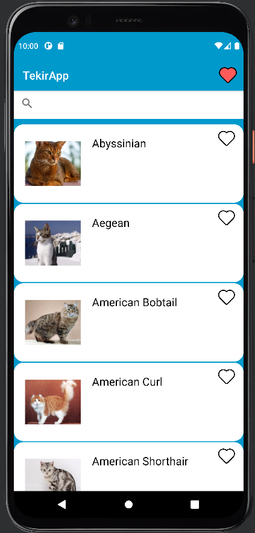
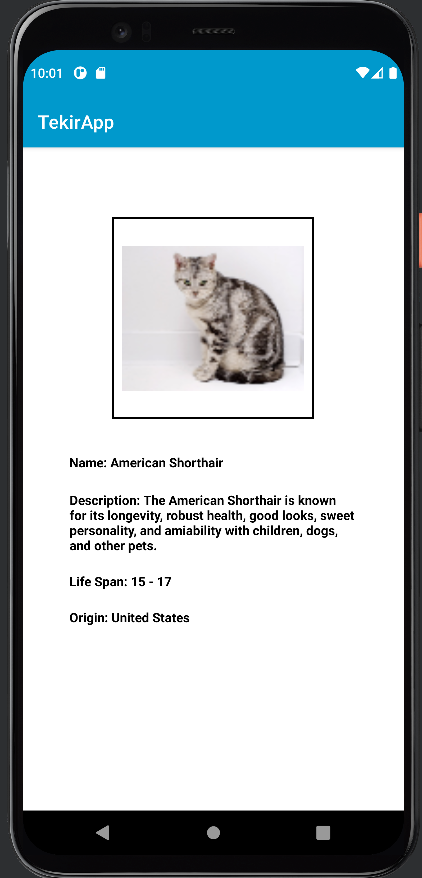

# Tekir 🐈

Tekir, API'den kedi ırkları ve bilgilerinin yer aldığı bir uygulama.

# Uygulama Görüntüleri

   
  

# API 

API:
https://docs.thecatapi.com/api-reference/breeds/breeds-list

# Kullanılan Teknolojiler

<ul>
  <li>Java</li>
  <li>REST API</li>
</ul>

# İletişim

`Kerem Ersu` => [LinkedIn](https://www.linkedin.com/in/kerem-ersu-0082ba194/)
